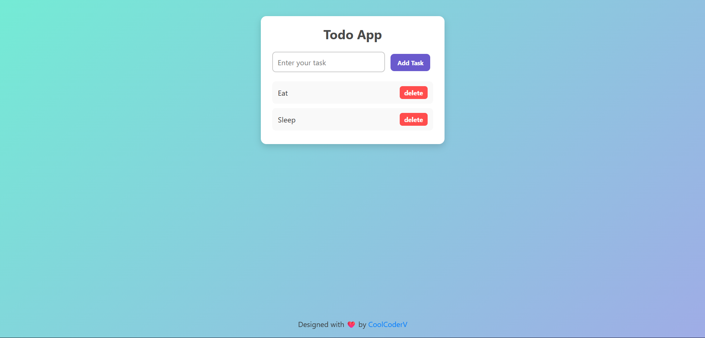

# ✅ Todo App

A simple and interactive **Todo App** built using **HTML, CSS, and JavaScript**.  
It allows users to add, delete, and manage their daily tasks in a clean interface.

---

## Live Demo

Check out the live version of the project:

[](https://vaibhavpal7549.github.io/Todo-App/)

---

## ✨ Features
- ➕ Add new tasks
- ❌ Delete tasks with a single click
- 🧹 Clear input field after adding a task
- 🎨 Minimal and responsive UI
- ⚡ Uses **DOM manipulation & event delegation**

---

## 🛠️ Tech Stack
- **HTML5** – structure
- **CSS3** – styling
- **JavaScript (ES6)** – functionality

---

## 📷 Screenshot


---

## License  
This project is licensed under the MIT License - see the [LICENSE](LICENSE) file for details.

---

## 🚀 Getting Started

### 1. Clone the Repository
```bash
git clone https://github.com/vaibhavpal7549/todo-app.git
